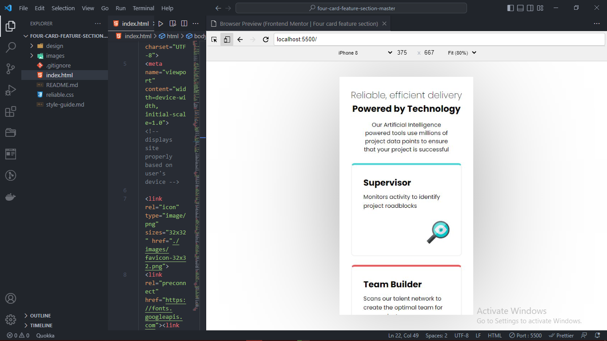
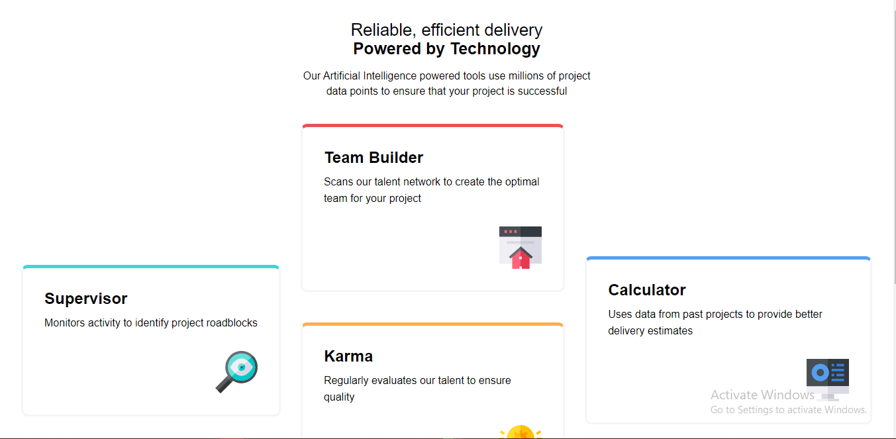

# Frontend Mentor - Four card feature section solution

This is a solution to the [Four card feature section challenge on Frontend Mentor](https://www.frontendmentor.io/challenges/four-card-feature-section-weK1eFYK). Frontend Mentor challenges help you improve your coding skills by building realistic projects. 

## Table of contents

- [Overview](#overview)
  - [The challenge](#the-challenge)
  - [Screenshot](#screenshot)
  - [Links](#links)
  - [Built with](#built-with)
  - [Continued development](#continued-development)
- [Author](#author)

## Overview

### The challenge

Users should be able to:

- View the optimal layout for the site depending on their device's screen size

### Screenshot




### Links

- Solution URL: [https://github.com/oladee/four-card-feature-section-master](https://your-solution-url.com)
- Live Site URL: [Visit live](https://oladee.github.io/four-card-feature-section-master/)


### Built with

- Semantic HTML5 markup
- CSS custom properties
- Flexbox
- CSS Grid
- Mobile-first workflow

### What I learned

```
```css
.proud-of-this-css {
    display: grid;
        grid-template-columns: auto auto auto;
        grid-template-rows: repeat(8, 100px);
        grid-template-areas:
                            ". team ."
                            ". team ."
                            "superi team cal"
                            "superi karma cal"
                            "superi karma cal"
                            ". karma .";
        column-gap: 30px;
}
```

### Continued development

This project tested my ability to be able to use css grid to be able to set a responsive row, column design for the large screen sze view, although starting at first i wasn't sure about how to go about it, it all became clearer with each new construct, i still look forward to learning more on css grid and its complexities, due to how much of a powerful tool it is.

## Author

- Website - [Momoh Oladimeji](https://www.github.com/oladee)
- Frontend Mentor - [@oladee](https://www.frontendmentor.io/profile/oladee)
